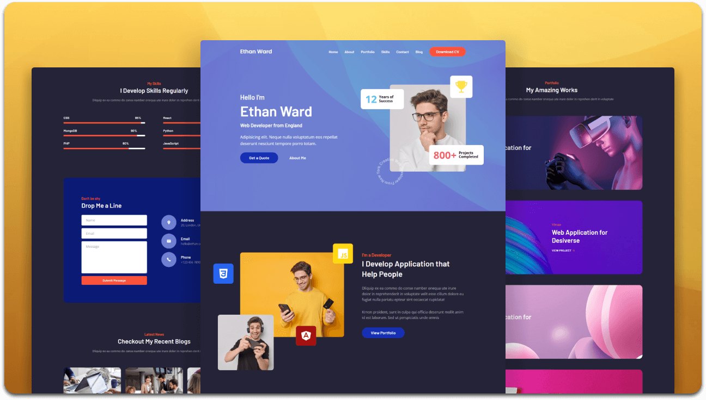

  <h2 align="center">Personal Portfolio Website</h2>

  Fully responsive personal portfolio website, <br />Responsive for all devices, built using HTML, CSS, and JavaScript.

  <a href="https://codewithsadee.github.io/portfolio/"><strong>➥ Live Demo</strong></a>

</div>

<br />

### Demo Screeshots




### Run Locally

To run **Portfolio** locally, run this command on your git bash:

Windows:

```bash
git clone https://github.com/codewithsadee/portfolio.git
```

### License

This project is **free to use** and does not contains any license.
